<!DOCTYPE html>
<html>
<head>
	<meta http-equiv="content-type" content="text/html; charset=utf-8"/>
	<title></title>
	<meta name="generator" content="LibreOffice 7.4.3.2 (MacOSX)"/>
	<meta name="author" content="Admin"/>
	<meta name="created" content="2024-10-05T03:09:00"/>
	<meta name="changedby" content="Admin"/>
	<meta name="changed" content="2024-10-05T03:09:00"/>
	<meta name="AppVersion" content="15.0000"/>
	
</head>
<body lang="vi-VN" link="#000080" vlink="#800000" dir="ltr">

 
 

 
 

 
 

 
 

 
 

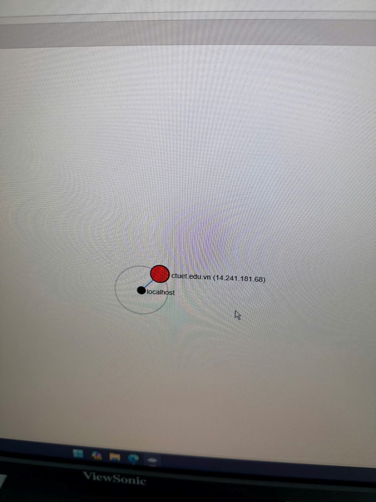
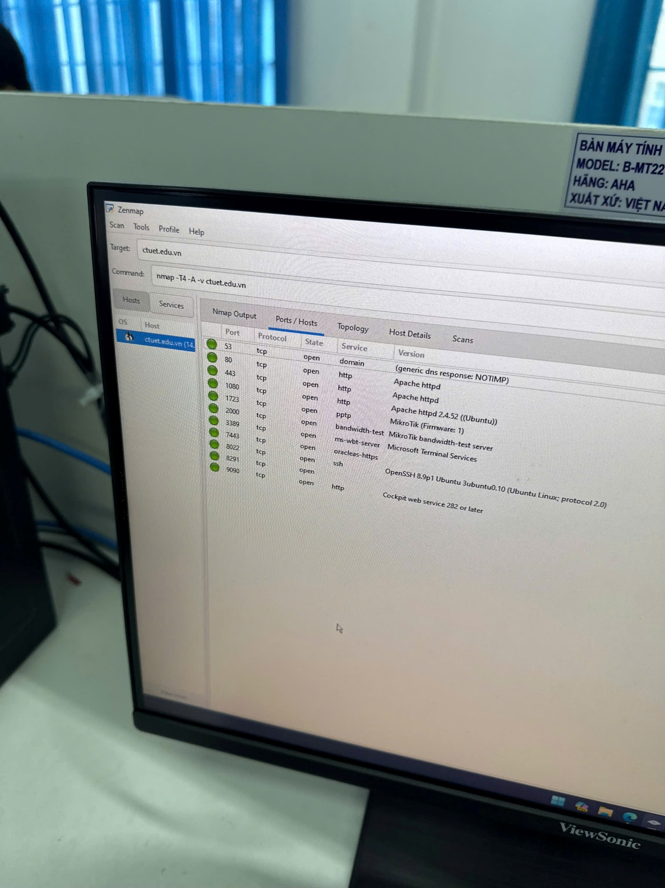
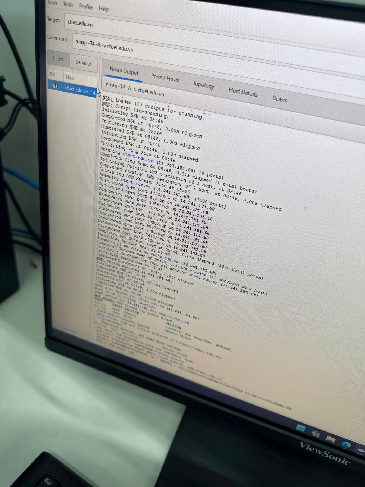
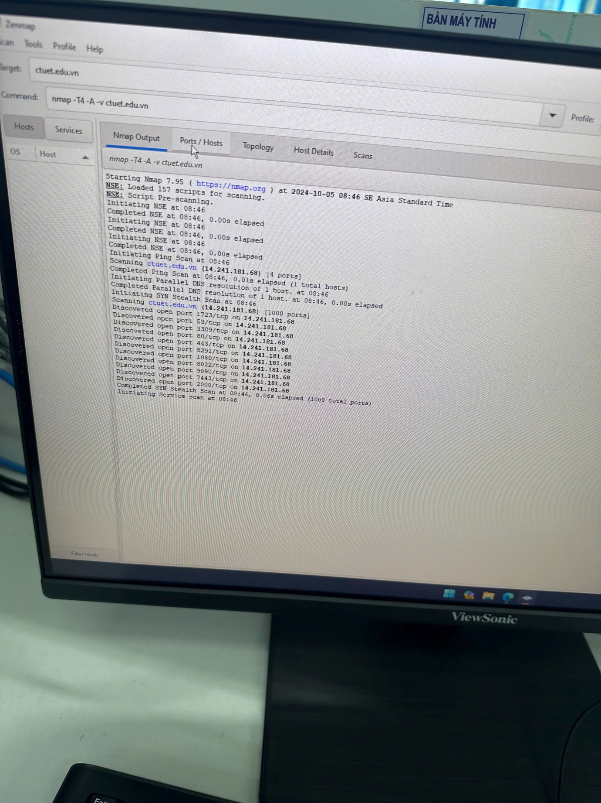

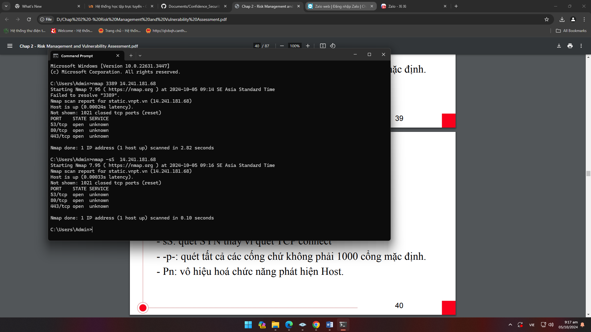
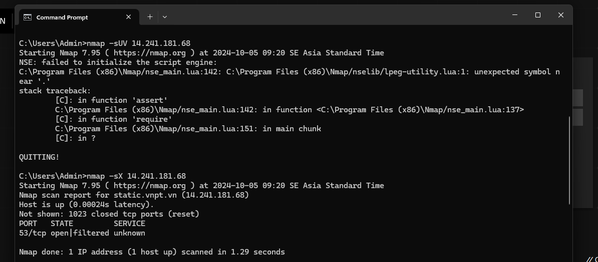
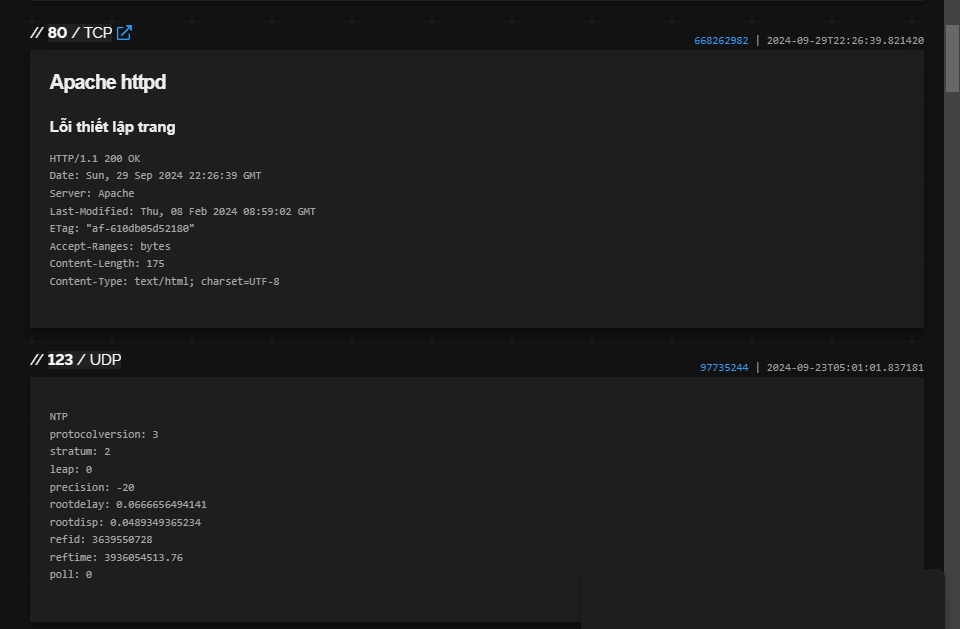
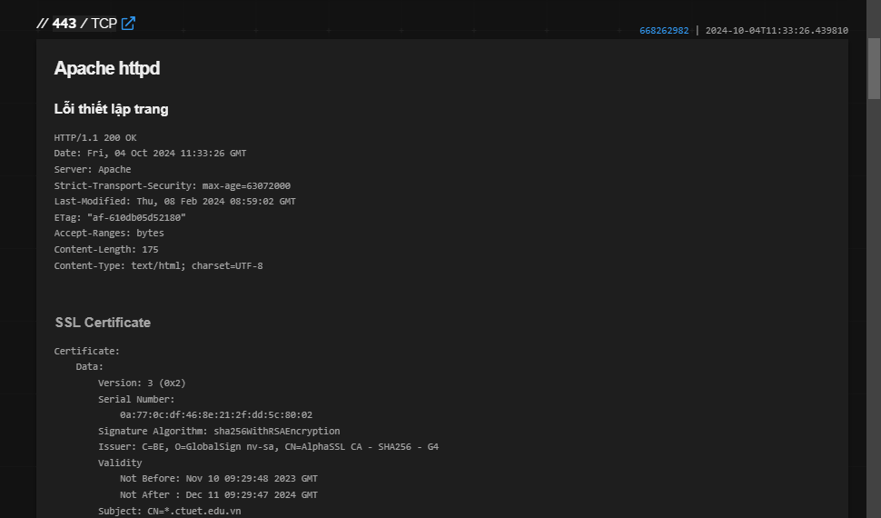
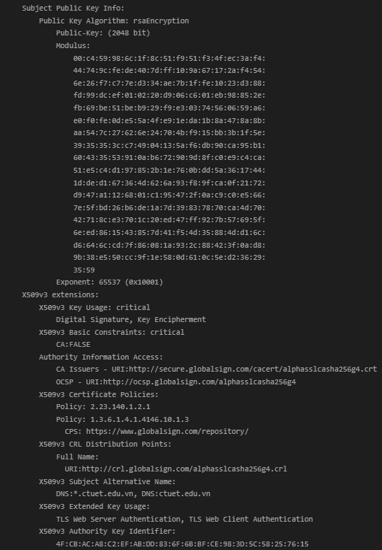
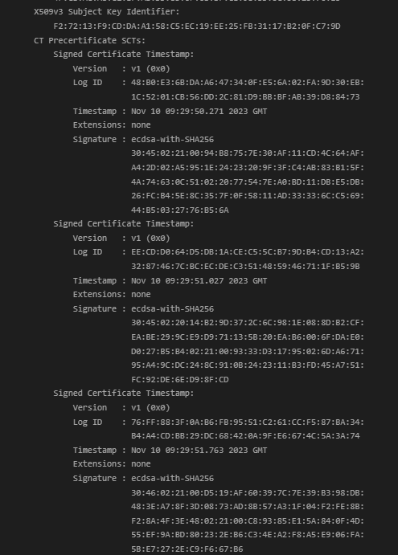
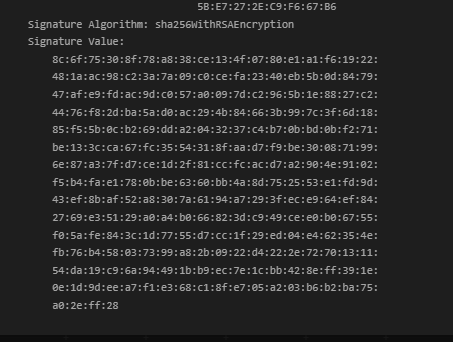

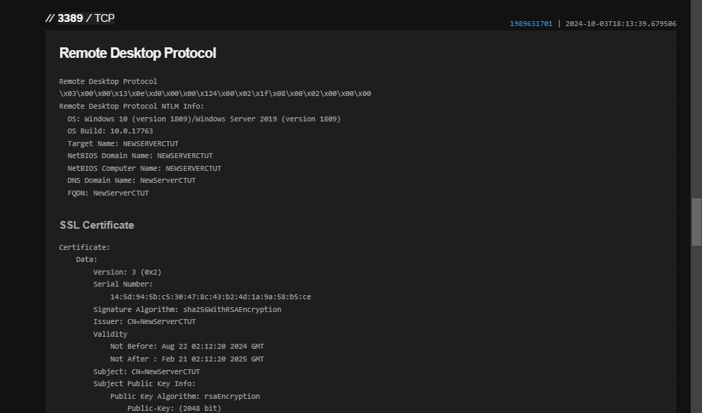
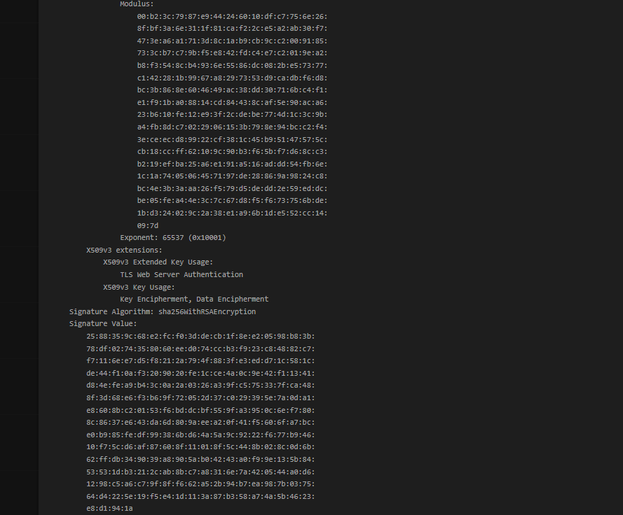
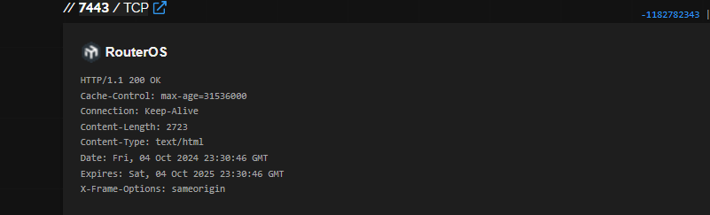
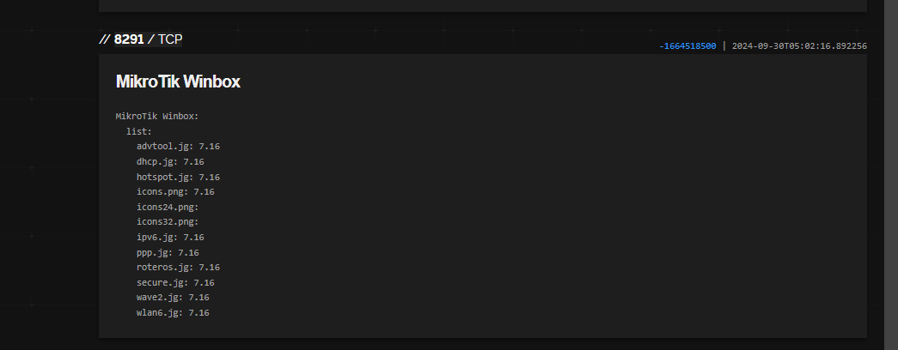
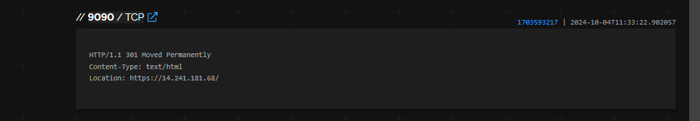
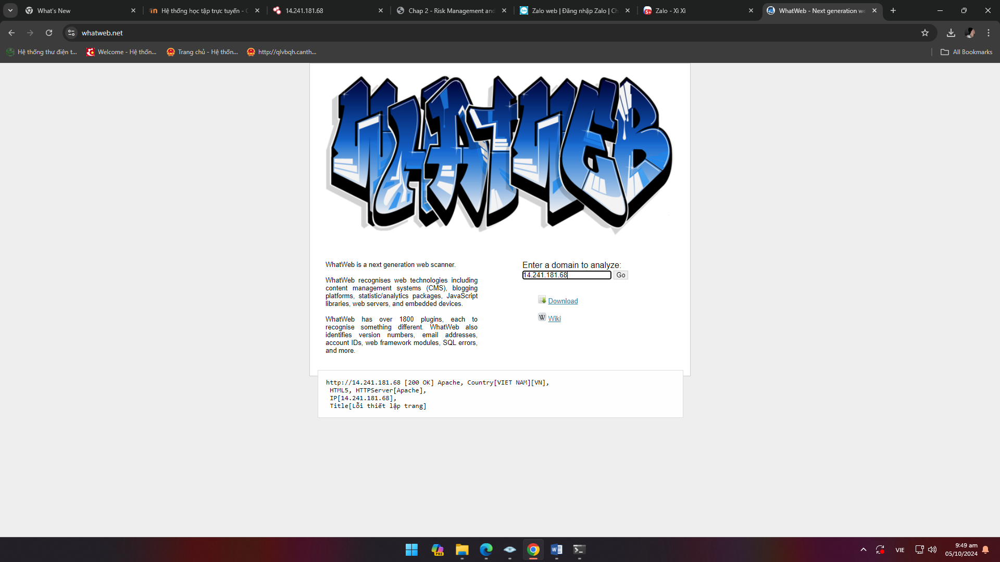
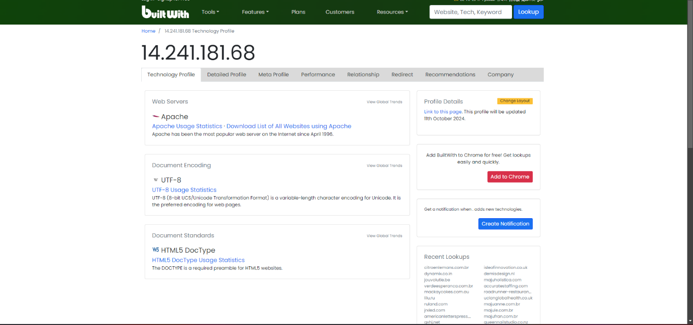

</body>
</html>
